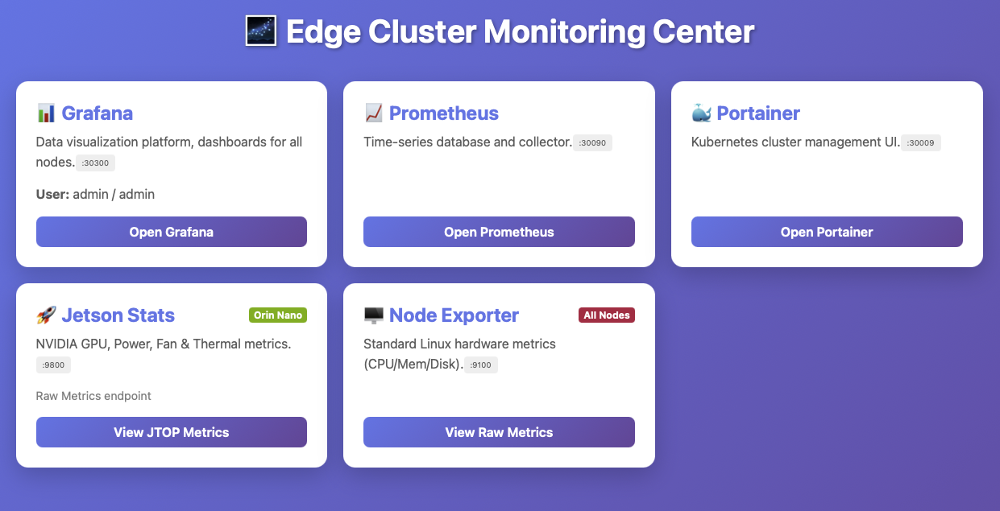
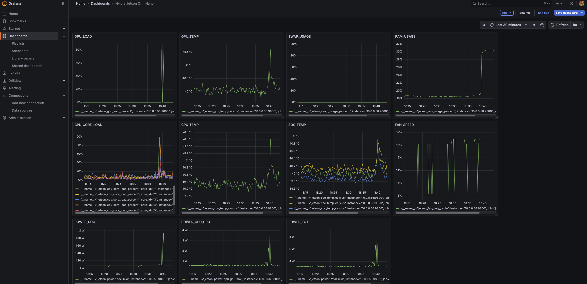

# 🌌 Edge K3s Cluster: Raspberry Pi & Jetson Orin Nano

This project implements a lightweight **Edge Computing Cluster** using **K3s**. It seamlessly integrates heterogeneous ARM64 hardware, featuring a Raspberry Pi as the control plane and an NVIDIA Jetson Orin Nano as a GPU-accelerated worker node.

Key features include a **hybrid container runtime** setup, a custom-built **Jtop Exporter** for deep hardware monitoring (GPU, Power, Thermal), and a unified web dashboard for cluster management.

## 🏗️ Architecture Overview

| Role | Device | OS / Arch | Key Components | Notes |
| :--- | :--- | :--- | :--- | :--- |
| **Master** | Raspberry Pi 4B/5 | Ubuntu / ARM64 | K3s Server, Prometheus, Grafana | Control Plane, lightweight workload |
| **Worker** | **NVIDIA Jetson Orin Nano** | Ubuntu 20.04 (L4T) | K3s Agent (**Docker**), **Jtop Exporter** | AI Inference, GPU Compute Node |
| **Client** | MacBook Pro | macOS | kubectl, Browser | Cluster Management |

### ✨ Key Features

  * **Hybrid Runtime**: The Master node uses K3s's default `containerd`, while the Jetson Worker uses `docker` to leverage the **NVIDIA Container Runtime** for GPU access.
  * **Custom Monitoring**: A self-contained Python Exporter using the `jtop` library to scrape Orin Nano specific metrics (GPU Load, Fan Speed, Voltage, Mult-zone Temperatures).
  * **Unified Dashboard**: An Nginx-based static navigation portal that automatically adapts to the node IP, integrating Portainer, Grafana, and Prometheus.
  * **Edge Optimized**: Includes fixes for Jetson L4T `nftables` compatibility and `hostNetwork` configurations for bare-metal metric access.
### Monitor Center

### Jetson Dashboard

-----

## 🛠️ Prerequisites

### 1\. Fix Jetson Network Compatibility (Critical)

The Jetson L4T kernel has incomplete support for `nftables`, which causes K3s/CNI failures. You **must** switch to `iptables-legacy` mode on the Jetson node:

```bash
# Execute on Jetson Orin Nano
sudo update-alternatives --set iptables /usr/sbin/iptables-legacy
sudo update-alternatives --set ip6tables /usr/sbin/ip6tables-legacy
sudo reboot
```

### 2\. Install K3s

  * **Master (Raspberry Pi)**: Standard installation.
    ```bash
    curl -sfL https://get.k3s.io | sh -
    ```
  * **Worker (Jetson)**: Install as an Agent using the **Docker** runtime.
    ```bash
    curl -sfL https://get.k3s.io | K3S_URL=https://<Master-IP>:6443 K3S_TOKEN=<MyToken> sh -s - --docker
    ```

-----

## 🚀 Deployment Guide

### Step 1: Build the Custom Jetson Exporter

Since `jetson-stats` requires direct access to the host's Unix Domain Socket, we use a **"Build Local, Use Local"** strategy.

1.  **Prepare Directory** on Jetson: `~/my-jetson-exporter`.
2.  **Create `Dockerfile`**:
    ```dockerfile
    FROM python:3.9-slim
    RUN pip install prometheus-client jetson-stats
    COPY exporter.py /exporter.py
    # Use -u to disable output buffering for real-time logs
    CMD ["python3", "-u", "/exporter.py"]
    ```
3.  **Create `exporter.py`**: (This script collects metrics from `jtop` and exposes them on port 9800. Ensure it handles `KeyError` safely for the Orin architecture).
4.  **Build the Image**:
    ```bash
    sudo docker build -t local/jetson-exporter:v1 .
    ```

### Step 2: Apply Kubernetes Manifests

This project uses two main manifest files:

  * `monitoring-k8s.yaml`: Deploys the monitoring stack (Prometheus, Grafana, Portainer, Exporters, Nginx).

Run the following on your **MacBook (Client)**:

```bash
kubectl apply -f monitoring-k8s.yaml
```

**Configuration Highlights (`monitoring-k8s.yaml`):**

  * **`hostNetwork: true`**: Allows the exporter to access the host network interface directly.
  * **`imagePullPolicy: Never`**: Forces K8s to use the locally built Docker image on the Jetson node, preventing it from trying to pull from Docker Hub.
  * **`securityContext: privileged: true`**: Grants permission to read `/run/jtop.sock`.

-----

## 🖥️ Service Access

The cluster uses **NodePort** services, making them accessible via **ANY node's IP** (Raspberry Pi or Jetson).

| Service Name | Port | Default Creds | Description |
| :--- | :--- | :--- | :--- |
| **Nginx Dashboard** | **:30080** | N/A | **Main Entry Point**. Links to all services. |
| **Grafana** | :30300 | admin / admin | Data Visualization |
| **Portainer** | :30009 | (Set on 1st login) | Cluster & Container Management |
| **Prometheus** | :30090 | N/A | Metrics Database |
| **Jetson Metrics** | :9800 | N/A | Raw JTOP Data |

> **Tip**: Open `http://<Jetson-IP>:30080` in your browser to see the unified dashboard.

-----

## 📊 Grafana Configuration

1.  **Add Data Source**:
      * Type: Prometheus
      * URL: `http://prometheus:9090` (or `http://prometheus.monitoring.svc.cluster.local:9090`)
2.  **Import Dashboards**:
      * **ID 13353**: Jetson Stats (GPU Load, Power, Thermal).
      * **ID 1860**: Node Exporter Full (CPU, RAM, Disk).
      * **ID 315** or **14282**: Kubernetes Cluster / Kubelet.

-----

## 🔧 Troubleshooting

**Q1: Jetson Exporter status is `ImagePullBackOff`.**

  * **Cause**: Kubernetes is trying to pull `local/jetson-exporter` from the internet.
  * **Fix**: Ensure the YAML spec contains `imagePullPolicy: Never` and the image tag matches exactly with `docker images`.

**Q2: Exporter logs show `JtopException` or connection failure.**

  * **Cause**: The container cannot access the host's `jtop` service.
  * **Fix**:
    1.  Verify `sudo systemctl status jtop` is active on the Jetson host.
    2.  Ensure `privileged: true` is set in the YAML.
    3.  Verify the volume mount for `/run/jtop.sock` is correct.

**Q3: `kubectl get pods` fails on Jetson with "connection refused".**

  * **Cause**: The Jetson is a Worker node and does not run the API Server.
  * **Fix**: Use `crictl ps` to view local containers, or copy `~/.kube/config` from the Master to the Jetson (updating the server IP).

**Q4: Portainer shows a "Timeout" page.**

  * **Cause**: Security feature. You must create an admin account within 5 minutes of startup.
  * **Fix**: Restart the pod: `kubectl rollout restart deployment portainer -n monitoring`.
-----
## ⚠️ Mixed Runtime Environment & Monitoring Configuration

This cluster operates in a **Hybrid Runtime Environment**, combining default K3s configurations with specialized hardware setups (NVIDIA Jetson). This introduces specific challenges for monitoring and data aggregation.

### Cluster Topology

| Node Name | Role | Hardware | Runtime | Notes |
| :--- | :--- | :--- | :--- | :--- |
| **raspberrypi** | Control Plane | Raspberry Pi 5 | `containerd` | Default K3s runtime. |
| **ubuntu** | Worker | Jetson Orin Nano | `docker` | Uses Docker Shim to support legacy Jetson GPU tools. |

### 🔍 Monitoring Compatibility Notes (cAdvisor)

Due to the difference in Container Runtimes (**Docker** vs. **Containerd**), `cAdvisor` reports metrics labels differently for each node.

* **The Issue:**
    * **Docker Runtime:** Historically exposes container names via the `name` label (derived from Cgroup paths).
    * **Containerd (CRI):** Does not expose human-readable Cgroup names. The `name` label is often empty or contains a UUID.
* **The Solution:**
    Standard Grafana dashboards often rely on `name!=""` filters, which causes data from the Jetson node to "disappear." **We must use standard Kubernetes labels (`container` and `pod`) instead of `name`.**

#### PromQL Query Adjustments

When querying metrics in Prometheus or Grafana, use the following patterns to ensure data from both runtimes is captured:

**❌ Avoid (Legacy Docker style):**
```promql
sum(rate(container_network_receive_bytes_total{name!=""}[5m])) by (name)
-----

## 📜 License

MIT License. Feel free to fork and modify for your own edge computing projects\!
